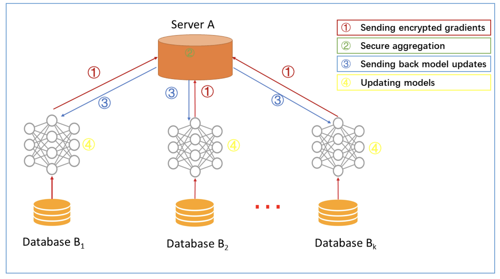
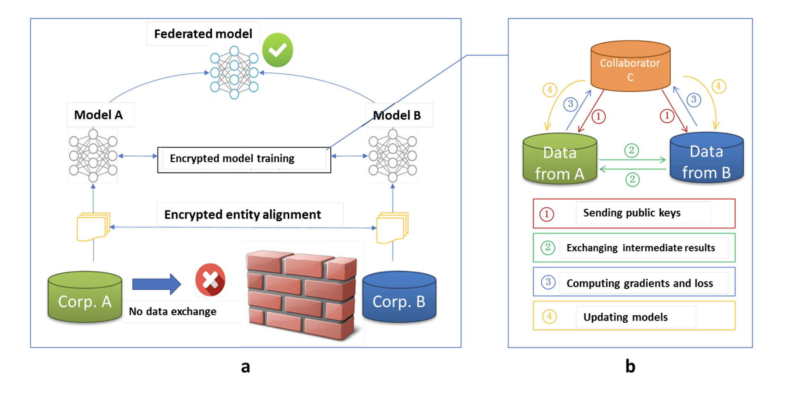
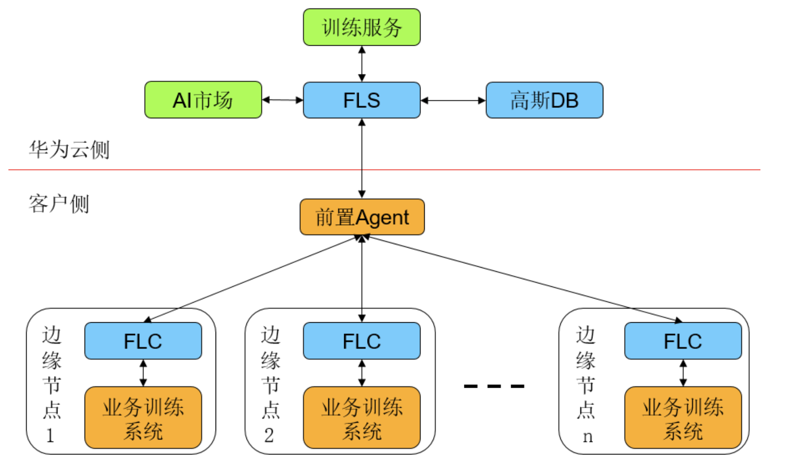
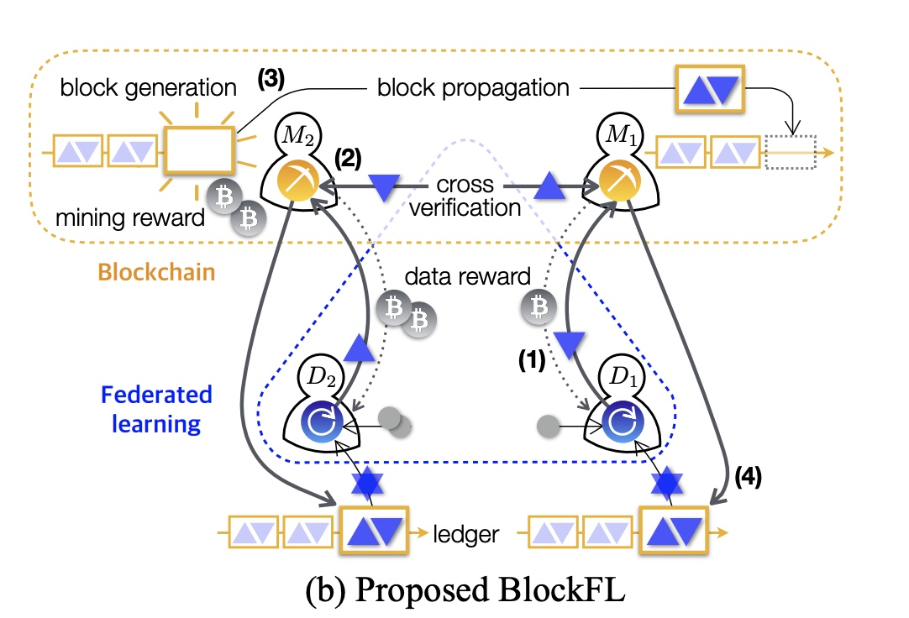

该文档为联邦学习综述性学习内容整理
# 联邦学习

- [待完成内容](#待完成内容)
- [联邦学习概述](#联邦学习概述)
  - [横向联邦学习](#横向联邦学习)
    - [安全的联邦平均算法（使用同态加密）Client - Server 模型](#安全的联邦平均算法使用同态加密client---server-模型)
  - [纵向联邦学习](#纵向联邦学习)
  - [迁移联邦学习](#迁移联邦学习)
- [实际应用](#实际应用)
  - [开源GIT项目](#开源git项目)
  - [华为NAIE - 横向联邦学习 Client v.s. Server 模型](#华为naie---横向联邦学习-client-vs-server-模型)
- [与区块链结合](#与区块链结合)
  - [华为方案](#华为方案)
  - [BlockFML论文提出方案](#blockfml论文提出方案)
- [参考文献](#参考文献)

## 标注格式

在括号中并具有？？？的内容为个人评价，需要后续验证。

## 待完成内容

1. 在纵向联邦学习时进行实体匹配使，RSA盲签名过程中，多出的一次签名流程的作用？
2. 横向联邦学习P2P模型中，是否可以向全部参与者发送训练参数？
3. 联邦学习与区块链的结合方式（？？？对抗联邦学习中的恶意模型）
4. 联邦模型的激励机制（？？？与区块链结合）
5. 深度梯度压缩（？？？可以减少通信宽带）

## 联邦学习概述

联邦学习模型可以看做一种具备安全验证的分布式学习模型。与多数机器学习模型一样，联邦学习分为两个过程：模型训练与模型推理。与一般机器学习不同的是，联邦学习在模型训练的过程中，将模型相关的信息以加密方式在各方站点之间交换且保证不暴露每个站点的数据源信息。在推理阶段，各站点将协作对新产生的实例进行预测，并由一个公平的价值分配机制，对各站点产生机制，从而使得联邦学习过程能够持续。

### 横向联邦学习

主要目的为扩充样本，适用场景为用户重叠少，特征重叠多的数据建模分析中，例如多家券商共同建立客户信用评级系统。

- Client-Server 模型：

操作步骤：

1. 各参与者对自身拥有数据进行分析建模。
2. 使用加密技术对梯度信息进行掩饰，并加密梯度发送给聚合服务器。
3. 服务器对加密梯度进行**安全聚合**。
4. 服务器将聚合后的结果发送给各参与方。
5. 各参与方对收到的梯度进行解密，并使用解密后的梯度结果更新各自的模型参数。

安全挑战模型：

在大部分横向联邦学习中，我们默认所有参与者是诚实的，即参与公司不会恶意提供信息从而破坏整体模型。【注：在参与者半诚实模型下该模式应该仍然安全（？？？）。因为在多方安全算法保护下参与者无法从梯度信息中获取关于其他参与者的具体数据】而计算中心是半诚实的（Honest but curious），即总计算中心不会向参与者恶意提供虚假信息，但会试图利用参与者的信息漏铜从中牟利。

也有小部分研究试图建立在参与者是恶意的这一安全挑战模型下的联邦学习模型。**待读**

- Peer-to-Peer 模型：

在P2P模型中，根据发送和接收模型参数信息的方式不同分为两种：

1. 循环传输：将所有参与者连接成环，依次将模型参数信息发送给下一个训练方。直到参数收敛或达到最大允许迭代次数/时间。
2. 随机传输：每一个训练者随机选择另一个训练方发送模型参数信息，直到参数收敛或达到最大允许迭代次数/时间。

问题：无法并行（？？？）

同时向全部参与者发送模型参数信息（？？？）

### 纵向联邦学习

主要目的为扩充特征，适用场景为用户重叠多，特征重叠少的数据建模分析中，例如银行与消费电商共同建立客户消费能力评级系统。  

操作步骤：

1. 加密样本对齐。
2. 对对齐样本进行模型加密训练：
    - 由第三方C创建秘钥对，并将公钥发给 A 和 B。
    - A和B分别计算和自己相关的特征**中间结果，并加密交互**，用来求得各自梯度和损失；**（待读）**
    - A和B分别计算各自加密后的梯度并添加掩码发送给C，同时B计算加密后的损失发送给C；
    - C解密梯度和损失后回传给A和B，A、B去除掩码并更新模型。

安全挑战模型：

在大部分纵向联邦学习中，我们默认所有参与者都是半诚实的，即所有参与者都不会恶意提供虚假数据样本以及相关特征，但会试图利用其他参与者的信息漏洞并从中牟利。

### 迁移联邦学习

既扩充样本，又扩充特征。**待读**

## 实际应用

### 开源GIT项目

- [Pysyft](https://github.com/OpenMined/PySyft) 

> 适用于横向联邦学习的开源项目，使用基于同态加密算法与秘密共享的安全协议。

- [FATE](https://github.com/FederatedAI/FATE) 

> 适用于横向、纵向、以及迁移联邦学习的开源项目，使用基于同态加密算法与秘密共享的安全协议。
>
> 具体更多内容可参考[FATE部署学习记录](https://github.com/fei-chang/Federated_Learning/blob/main/FATE_standalone.md)

- [Asylo](https://github.com/google/asylo) Google开发，需在TEE中执行。**待查**

- [Apache Teaclave](https://teaclave.apache.org/) 百度开发，Apache孵化中，TEE执行方案。**待查**

### 华为NAIE - 横向联邦学习 Client v.s. Server 模型

[华为NAIE：网络智能体（Network AI Engine）](https://www.huaweicloud.com/product/naie.html)
支持功能：

- 支持多种边缘计算框架
  - 支持客户端节点使用Tensorflow、Caffe、Pytorch三种深度学习框架生成的模型进行联邦学习，无需用户进行模型文件适配。

- 支持多种联邦汇聚算法
  - 联邦聚合算法：联邦基础的加权平均算法，适用于各类计算梯度下降求解的算法。
  - 学习率衰减：开启学习率衰减算法，能够让联邦收敛的更加平滑，同时能够达到最优解。
  - 梯度分叉算法：开启自适应算法（又名梯度分叉法），达到相同精度的要求下可以有效的减少本地训练时长。

- 支持多种安全隐私算法
  - 多方安全计算：在安全要求较高的场景下，开启安全多方算法可以实现本地模型的信息不被服务端获取，同时不降低模型的精度。
  - 差分隐私：在安全场景下，通过不同阶段加噪，最大化数据查询的准确性同时最大限度减少识别数据的机会。

- 支持多种模型压缩算法
  - 参数冻结法：压缩算法，根据模型变化趋势调节每轮联邦汇聚的参数达到降低通信带宽的目的。
  - 随机挑参法：在多节点场景下，每个客户端随机上传部分参数达到降低通信带宽的目的。

- 支持联邦可视化
  - 边缘节点的状态（包括离线、空闲、训练、评估等）；
  - 边缘节点训练的相关信息（如：样本数，训练时长，准确率，带宽使用等）的实时及历史可视化展示。

架构模式：

## 与区块链结合

思路概述：对于Client-Server模型，将每次参与通讯网络的本地模型上链存储，保证学习模型来源可追溯且不可篡改。

负面问题：通讯成本过高（？？？）【在联邦学习中，可能需要节点多次与其他节点或是服务器沟通，通过模型的多次迭代更新以获取更好的训练效果。然而，上链操作一定程度上会提高通讯成本。】

### 华为方案

基于区块链存储每次参加全局迭代的本地模型，保证学习模型的来源、初始化参数、时间顺序不可篡改。增加学习模型的验证和审计能力，防止数据提供方作恶，并支持所有中间过程可追溯可审计

### BlockFML论文提出方案

作为激励机制（？）。

## 参考文献

[联邦学习白皮书v2.0](https://aisp-1251170195.cos.ap-hongkong.myqcloud.com/wp-content/uploads/pdf/%E8%81%94%E9%82%A6%E5%AD%A6%E4%B9%A0%E7%99%BD%E7%9A%AE%E4%B9%A6_v2.0.pdf)

概述性文章。

[Federated Machine Learning: Concept and Applications](https://arxiv.org/pdf/1902.04885.pdf)

主要对于联邦学习模型的概念性介绍与安全性证明。

[On-Device Federated Learning via Blockchain and its Latency Analysis](https://arxiv.org/pdf/1808.03949v1.pdf)

对于联邦学习与区块链结合的构思之一，对于一般联邦学习模型添加了激励机制。通过向用户分发数据（梯度参数）鼓励用户参与联邦学习运算并为联邦模型提供数据（？？？）

[Advances and Open Problems in Federated Learning](https://arxiv.org/pdf/1912.04977.pdf) **待读**

[A Secure Federated Transfer Learning Framework](https://arxiv.org/pdf/1812.03337.pdf) **待读**

[FedCoin: A Peer-to-Peer Payment System for Federated Learning](https://arxiv.org/pdf/2002.11711.pdf) **待读**
